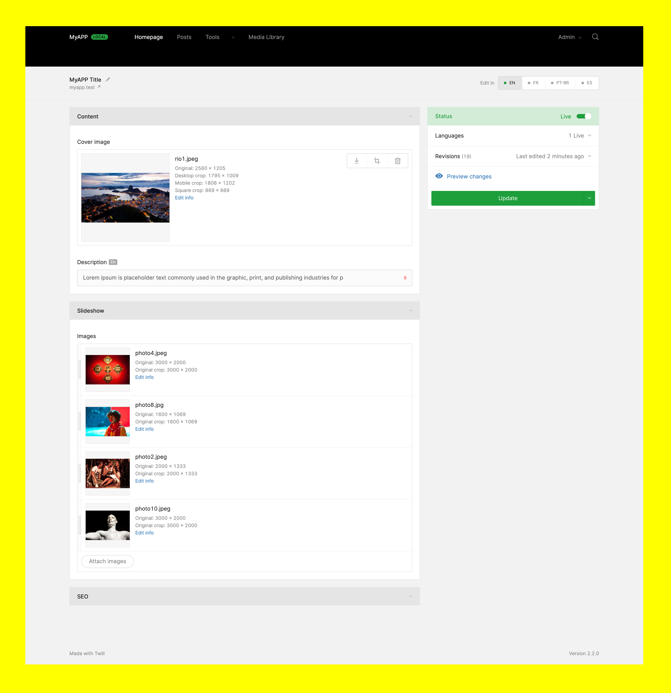

# Homepages Capsule

### A [Twill Capsule](https://github.com/area17/twill) to create a Home page for your website



### Description

This Capsule aims to create a single page home page and for that it ensures you will always have one and only one homepage record on your database.

It also contains a middleware to shut down your website (like the `php artisan down` command) when unpublishing the homepage:

```php
protected $middleware = [
    ...
    \App\Twill\Capsules\Homepages\Http\Middleware\Shutdown::class,
];
```

**Please make sure your users have the proper permissions to edit/unpublish the homepage.**

## Installing

If you are using the `twill:capsule:install`, make sure Twill/Capsules directory exists (bug will be fixed soon):

```bash
mkdir -p app/Twill/Capsules
```

You can clone, copy the zip or do it via

```
php artisan twill:capsule:install homepages
```

Create a `front.home` route to your homepage:

```php
Route::get('/', fn() => print 'This is the homepage')->name('front.home');
```

## Navigation

Add this to `twill-navigation.php` to make your homepage link go directly to the edit page:

```php
return [
    'homepages' => [
        'title' => 'Homepage',

        'route' => 'admin.homepages.landing',
    ],
];
```

## Dependencies

-   Depends on the [Twill Capsules Base](https://github.com/area17/twill-capsule-base) repository.
-   Integrated to [Twill Transformers](https://github.com/area17/twill-transformers).

## Crops

A base cropping systems was put in place, so for the block editor you need to configure your `twill.php` to be something like:

```php
'blocks' => [
    'crops' => Crops::BLOCK_EDITOR,
],
```
